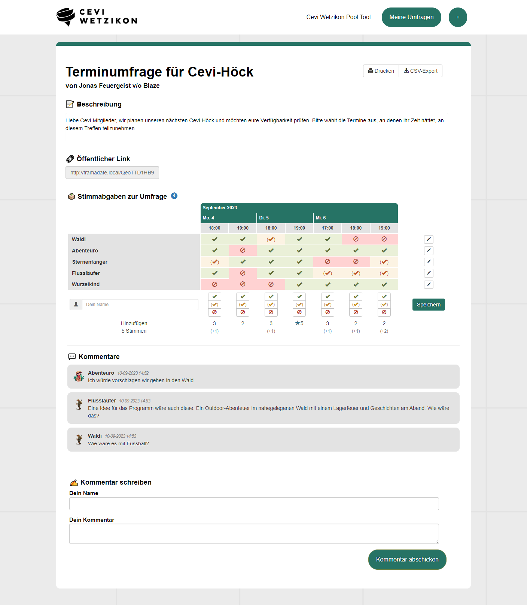
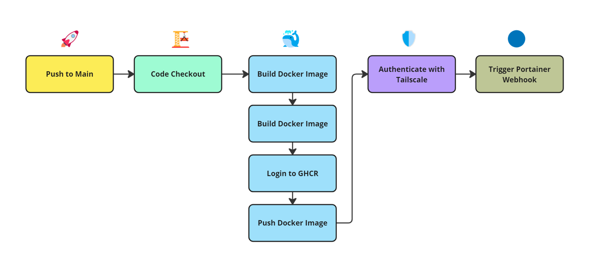
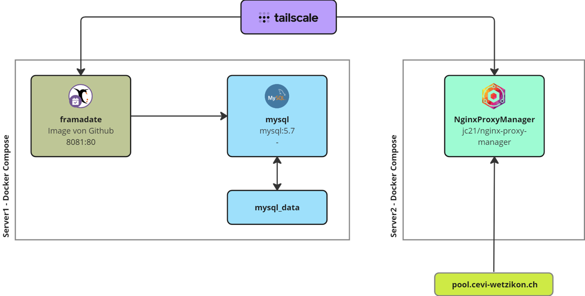

# Framadate-Docker Cevi Wetzikon

Nuddle / Doodle alternative for the Cevi Wetzikon

Website available on [pool.cevi-wetzikon.ch](https://pool.cevi-wetzikon.ch)



## 🚀 Deployment

### 🐙 Github Action
With the [Dockerfile](Dockerfile) and the [Github Action](.github/workflows/publish-ghcr.yaml), an image is automatically created, which is then uploaded to the GitHub Container Registry and automatically deployed on pool.cevi-wetzikon.ch via Tailscale and Portainer Webhook.




## 🐳 Docker Compose

The Cevi Wetzikon Pool Tool with the two containers is deployed on the Docker Ubuntu Server from Lino.


<br><br>
The following Docker Compose is used in Portainer on the Docker Ubuntu Server from Lino, where the custom Framadate image is re-pulled directly via Portainer Webhook.
<br>

```bash
version: '3'
services:
  framadate:
    image: ghcr.io/surmatik/framadate-ceviwetzikon:latest
    ports:
      - "8081:80"
    depends_on:
      - mysql
    volumes:
      - /opt/docker/framadate-ceviwetzikon/framadate-config.php:/var/www/framadate/app/inc/config.php
  mysql:
    image: mysql:5.7
    environment:
      - MYSQL_ROOT_PASSWORD=${MYSQL_ROOT_PASSWORD}
      - MYSQL_DATABASE=${MYSQL_DATABASE}
      - MYSQL_USER=${MYSQL_USER}
      - MYSQL_PASSWORD=${MYSQL_PASSWORD}
    volumes:
      - mysql_data:/var/lib/mysql
    command: --bind-address=0.0.0.0

volumes:
  mysql_data:
```
Environment variables:

- MYSQL_ROOT_PASSWORD
- MYSQL_DATABASE
- MYSQL_USER
- MYSQL_PASSWORD

<br><br>
To make the first deployment work, when starting the Docker Compose for the first time, the volume part for Framadate needs to be temporarily deleted since the config.php and the database creation are done via a setup on the Webserver.


## 📊 Database

The database configuration must be provided as follows during the setup on the web:

DB Server Name: mysql:host=mysql;dbname=framadate;port=3306 <br>
DB User: framadate <br>
DB Password: your_password

Framadate uses the following five tables in the MySQL database:

- fd_comment
- fd_framadate_migration
- fd_poll
- fd_slot
- fd_vote

## 🚀 Local Deployment

1. Clone the [Framadate-CeviWetzikon](https://github.com/surmatik/Framadate-CeviWetzikon.git) Repoistory from Github.
    ```bash
    git clone https://github.com/surmatik/Framadate-CeviWetzikon.git
    ```

2. Build the image from the Dockerfile
    ```bash
    docker compose build
    ```

3. start the containers with the 'docker-compose.yml'.
    ```bash
    docker compose up -d
    ```